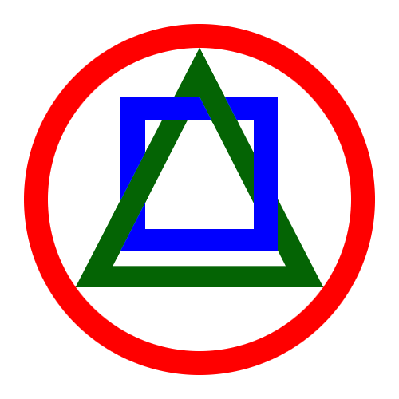

# ArchMeta API

Welcome to the official documentation for **ArchMeta API**.



A non-invasive, meta-annotation-driven framework providing an architectural construct topology vocabulary for automated documentation, diagramming, XML manifestation, and voluntary code governance for audit readynes.

## Quick Example

=== "Java Annotation"
    ```java
    @ArchitecturalConstruct(type = ConstructType.SERVICE)
    public class OrderProcessingService {
        // Non-invasive metadata tagging
    }
    ```

=== "XML Manifest Output"
    ```xml
    <topology>
        <construct type="SERVICE" class="OrderProcessingService"/>
    </topology>
    ```

!!! note "Non-Invasive Architecture"
    ArchMeta annotations serve purely as declarative metadata. They impose zero runtime side-effects or framework lock-in.
